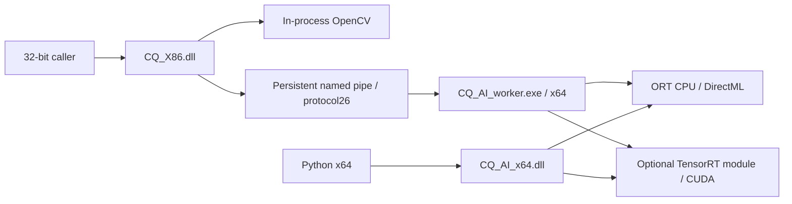

# Architecture

CQ_AI is a Windows C++17 library with a stable C ABI (60 public functions).

YOLO shares preprocessing, decoding and backend selection across x86 and x64.
Session count is execution-slot capacity, separate from callers and ORT threads.
Each DirectML Session serializes Run; each TensorRT slot owns its context, stream
and buffers. BMP views, reusable workspaces and request IDs cover the common path.
OCR retains devices0..2 and ORT. CV runs in the host DLL.

The core Worker embeds its fixed ORT/DirectML runtime and OCR assets; optional
NVIDIA dependencies remain a separate package. A model pool owns the backend and
leases slots with RAII. Runtime status identifies the actual backend/device.

Repository flow: source + locked dependencies -> build -> verified candidate ->
HTML/archives -> cohort promotion. `release/current.json` locates the immutable
current manifest; `output/` is the local three-file deployment directory.

Detailed source mapping: [project guide](PROJECT_GUIDE_CN.md).
